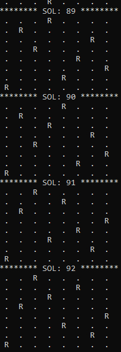

# AS 8 RAINHAS 

### O QUE EXATAMENTE SERIA O PROBLEMA

&nbsp &nbsp &nbsp Bom, é possivel colocar 8 rainhas em um tabuleiro só ? sabendo que as rainhas tem um movimento bem completo isso realmente pode sim se tornar um grande desafio, primeiramente acho interessante entendermos como a rainha se movimenta: 

  
  

&nbsp &nbsp &nbsp Agora que ja estamos de acordo com as movimentacoes da nossa rainha vamos tentar entender o codigo que ira solucionar isso, colocando em um tabuleiro 8x8 8 rainhas posicionadas de maneira com que nenhumas delas se ataque. <strong>OBS: a rainha da critico</strong>

### VAMOS FALAR DE CÓDIGO

&nbsp &nbsp &nbsp Como nossas funções auxiliares vamos gerar as permutações do vetor, precisamos de uma função auxiliar que troca/inverte dois elementos de um vetor, veja:
  
  
  

&nbsp &nbsp &nbsp Precisamos tambem verificar as nossas diagonais, e quem fara esse trabalho sera uma função que verifica se uma dada permutação do vetor linhas corresponde a uma solução do problema, veja.

  
  

&nbsp &nbsp &nbsp Para imprimir as soluções encontradas podemos utilizar isso: 
  
  

&nbsp &nbsp &nbsp Para iniciamos os nossos testes de permutação, vamos começar com a construção do vetor que apresenta na imagem como "int linhas[8]". Logo em seguida chamamos a função recursiva TestaPermutacoes, responsável por gerar as permutações, iniciando no índice zero.
  
  

&nbsp &nbsp &nbsp Na função TestaPermutacoes, os elementos com índices menores que k estão fixos. A função deve gerar as permutações dos elementos com índices maiores ou iguais a k. Se k=8, então todos elementos estão fixos e o vetor deve ser verificado e impresso (caso trivial). Caso contrário, fixamos um novo elemento na posição k e testamos as permutações a partir do índice k+1. Repetimos esse processo fixando todos os possíveis elementos na posição k.
  
  
  

&nbsp &nbsp &nbsp Okay, falei falei falei e ainda não mostrei nada! Então vamos ver como fica esse código funcionando, lembrando que o código original é em C e estará disponível aqui neste repositório a versão c. Executando ele podemos notar que nos da não uma solução, mas sim 92 soluções, vamos analisar melhor o que ele nos deu de resultado.
  
  

&nbsp &nbsp &nbsp Agora que podemos ver que ele gera vários resultados diferentes de soluções, vamos focar em uma apenas, irei pegar a numero 92 e, vamos pegar uma Rainha "R" e vejamos se ela de fato esta cumprindo seu papel de não poder tocar em ninguém (medidas preventivas do covid-19).
  
  
  

&nbsp &nbsp &nbsp E por fim, vamos ver como de fato ficaria cada Rainha com o traço de ataque, bom fica uma bagunça mas assim podemos ver de fato que as linhas sempre passam em redor das Rainhas e nunca a tocam, assim mantendo nossas Rainhas todas em segurança.
  
  
